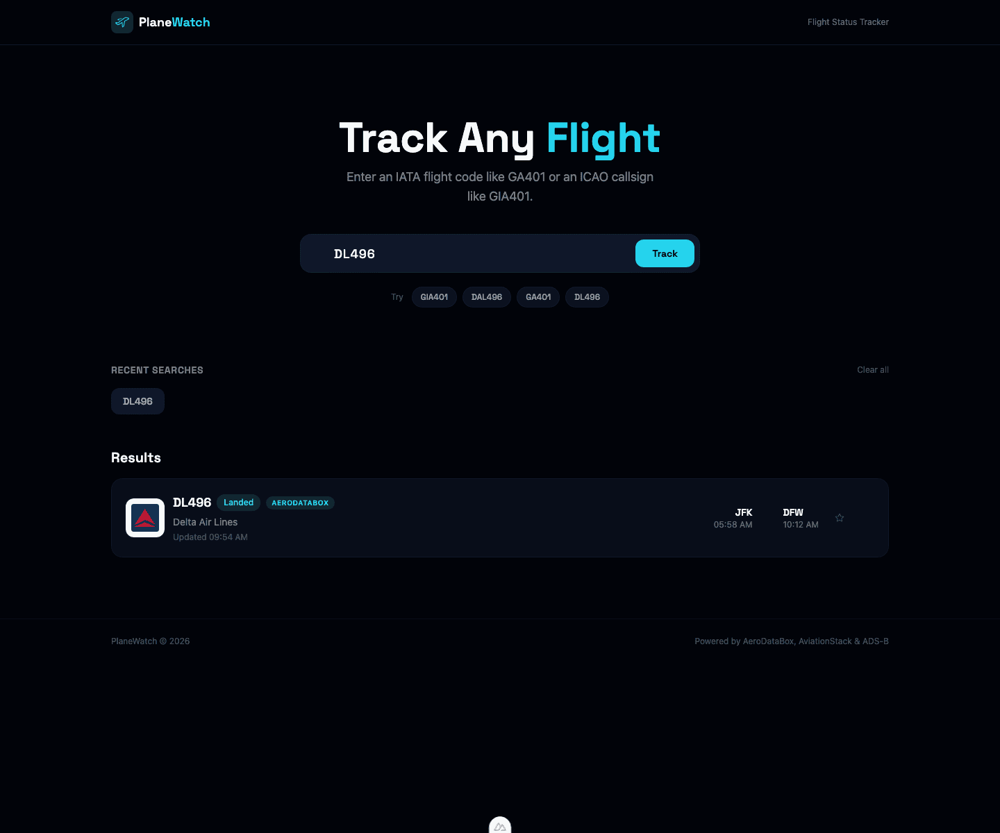
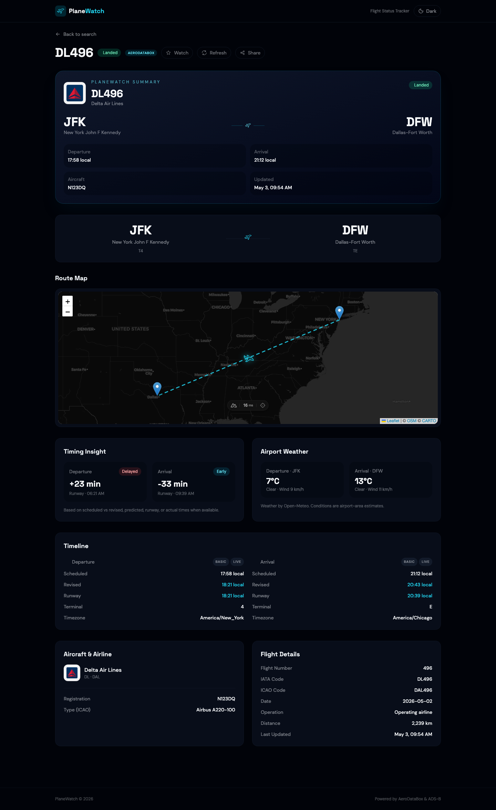

# PlaneWatch

PlaneWatch is a Nuxt/Vue flight status tracker. Search by flight number or callsign to see current status, route, schedule timing, aircraft information, and a map of the route.





## Features

- Search by IATA flight number (`GA401`, `DL496`) or ICAO callsign (`GIA401`, `DAL496`)
- AeroDataBox-powered scheduled flight data via private Nuxt server route
- ADS-B live fallback using ADSB.lol
- Automatic IATA → ICAO callsign variants for common airlines
- Flight detail pages with refresh/direct URL support
- Route map using OpenStreetMap/CARTO tiles
- Optional live ADS-B overlay on scheduled route maps
- Recent searches and 60-second cache to reduce API rate-limit hits
- Dark aviation-themed UI with custom plane SVG logo/favicon

## Tech Stack

- Nuxt 3 in CSR mode
- Vue 3 + Composition API
- TypeScript
- Tailwind CSS
- Pinia
- Leaflet + OpenStreetMap/CARTO tiles
- AeroDataBox via RapidAPI
- ADSB.lol

## Setup

Install dependencies:

```bash
npm install
```

Create local env file:

```bash
cp .env.example .env
```

Configure keys:

```env
NUXT_AERODATABOX_RAPID_API_KEY=your_rapidapi_key_here
```

`NUXT_AERODATABOX_RAPID_API_KEY` is server-only and should never be exposed publicly. The `NUXT_` prefix is Nuxt's runtime-config override mechanism; it is not public unless it starts with `NUXT_PUBLIC_`.

## Commands

```bash
npm run dev       # start local dev server
npm run build     # production build
npm run preview   # preview production build
npm run generate  # static generation
npm run test      # utility smoke tests
npm run test:secrets # build and verify secret sentinels are not bundled
```

## Deployment

PlaneWatch is configured as a CSR Nuxt app, but it still uses a Nuxt server API route to keep the AeroDataBox/RapidAPI key private. Deploy it to any host that supports Nuxt/Nitro server routes or serverless functions.

Good options include:

- Vercel
- Netlify (`netlify.toml` is included; Nitro's Netlify preset publishes static assets from `dist`)
- Render
- Railway
- Fly.io
- Node server/VPS using `npm run build` and `.output/server/index.mjs`

Set this environment variable in your hosting provider:

```env
NUXT_AERODATABOX_RAPID_API_KEY=your_rapidapi_key_here
```

If deploying to a purely static host, AeroDataBox calls will not work unless you also provide a separate backend/proxy for `/api/aerodatabox/flights/:code`.

## Example Searches

Try:

```txt
GIA401
GA401
DAL496
DL496
```

## Provider Flow

Search currently tries providers in this order:

```txt
AeroDataBox → ADSB.lol
```

AeroDataBox provides scheduled/status data such as route, airline, timing, aircraft, and airport coordinates.

ADSB.lol is free/no-key and only provides live aircraft positions when an aircraft is currently visible by callsign.

## Rate Limits

AeroDataBox/RapidAPI Basic plans may rate-limit rapid repeated searches. PlaneWatch uses a 60-second local cache to reduce repeated requests.

If you see rate-limit errors, wait a few seconds and retry.

## Maps

Maps use Leaflet with free CARTO dark tiles based on OpenStreetMap data. No map API key is required.

## Known Limitations

- ADS-B live overlay only appears when the aircraft is currently visible and broadcasting under a matching callsign.
- Some flights may report `Unknown` status depending on provider data freshness.
- Direct detail page loads use the same external provider limits as normal searches.

## Project Structure

```txt
components/   reusable Vue components
composables/  API clients, cache helpers
layouts/      app layout
pages/        Nuxt routes
server/api/   private provider proxy routes
stores/       Pinia state
types/        shared TypeScript types
utils/        flight code utilities
```
